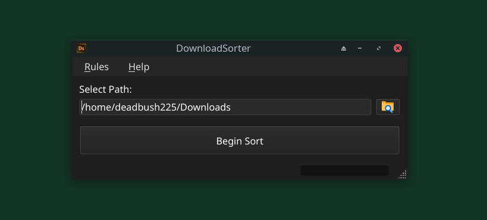
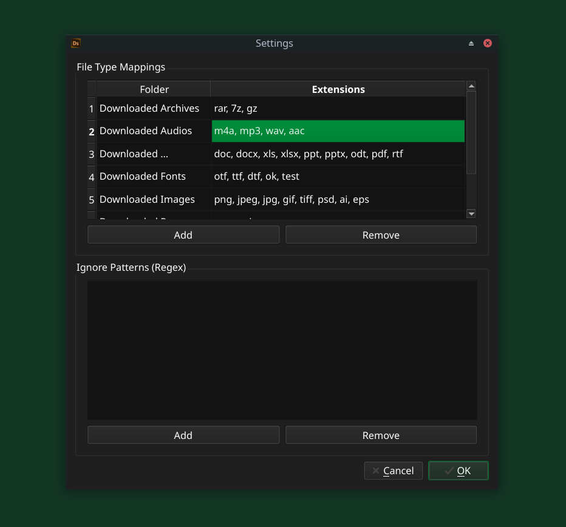

# Download Sorter

A lightweight program to automatically organize your assorted downloads by file type.

    

## Compatibility

- Windows 10 or later

## Installation

See [INSTALL.md](./INSTALL.md) for detailed instructions.

- Download the setup file from the `Release` section.
- Follow the installation procedure.

## Usage

1. Search for **Download Sorter** and launch the application.
2. Click the <kbd>Browse</kbd> button to select your downloads folder.
3. Click <kbd>Begin Sort</kbd> to organize your files by type.

> You can also manually map each file type to their own folder

